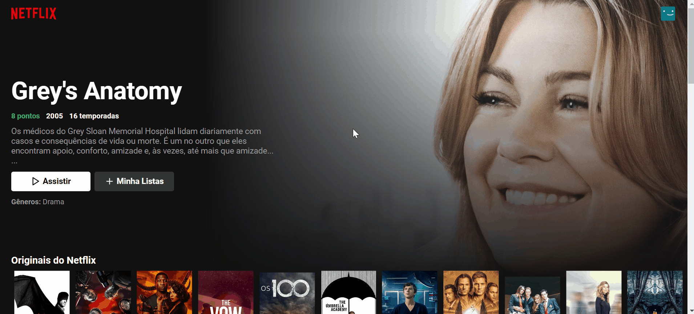

<h1 align="center">
 
 Clone do Netflix
  
</h1>
  
 
Trang web này là một bản sao của netflix dành cho mục đích thực hành và há»c tập.   Tất cả các quyá»n vá» hình ảnh đều thuộc vá» Netflix.

## Chức năng thứ nhất - Hoạt ảnh thanh trên cùng

 thay đổi dần dần thanh ở đầu trang web, được hiển thị   sau khi cuộn xuống một chút 

## Chức năng thứ 2 - Hoạt ảnh các phần tử trang web

 Giảm bớt sự nhấn mạnh vào các nút và hình ảnh từ phim . Từng bước nổi bật trong hình ảnh   khi di chuột qua chuột và dần trở lại vị trí cũ khi xóa chuột khá»i hình ảnh 

## Chức năng thứ 3 - Hoạt ảnh trong chuyển động của nội dung

 Di chuyển sang trái và phải trên bìa nội dung,   để bạn có thể xem thêm phim / loạt phim liên quan đến chủ đỠđã chá»n. 

## Chức năng thứ 4 - Màn hình tải Netflix cổ điển
<para> Màn hình tải được hiển thị khi truy cập trang web lần đầu tiên   hoặc khi trang được làm mới. 

## 🚀 Công nghệ được sử dụng
Đây là những công nghệ được sử dụng để sản xuất trang web
- ✔ JavaScript
- ✔ ReactJs
- ✔ useEffect
- ✔ useState
- ✔ CSS
- ✔ HTML
